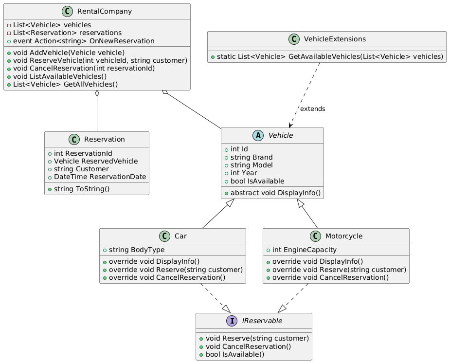

### **Zadanie: System Zarządzania Rezerwacjami Pojazdów w Wypożyczalni**  

#### **Cel**  
Celem zadania jest stworzenie aplikacji konsolowej w języku C#, która umożliwia zarządzanie rezerwacjami pojazdów w firmie wypożyczającej pojazdy. Program powinien wykorzystywać zasady programowania obiektowego oraz następujące elementy języka C#:  
- **Klasy abstrakcyjne**  
- **Interfejsy**  
- **Wyrażenia lambda**  
- **Zdarzenia**  
- **Metody rozszerzające**  
- **Testy jednostkowe**  

---

### **Wymagania funkcjonalne**  
1. **Dodawanie nowych pojazdów do wypożyczalni.**  
2. **Tworzenie rezerwacji na pojazdy.**  
3. **Wyświetlanie dostępnych pojazdów.**  
4. **Zarządzanie rezerwacjami (np. anulowanie, wyszukiwanie).**  
5. **Obsługa zdarzeń związanych z rezerwacją (np. powiadomienie o nowej rezerwacji).**  
6. **Testy jednostkowe dla kluczowych funkcjonalności.**  

---

### **Struktura systemu**  

1. **Klasa abstrakcyjna `Vehicle`**  
   - Powinna zawierać:  
     - Identyfikator pojazdu (`Id`)  
     - Markę i model (`Brand`, `Model`)  
     - Rok produkcji (`Year`)  
     - Status dostępności (`IsAvailable`)  
     - Metodę abstrakcyjną `DisplayInfo()`  

2. **Interfejs `IReservable`**  
   - Definiuje metody związane z zarządzaniem rezerwacjami:  
     ```csharp
     interface IReservable
     {
         void Reserve(string customer);
         void CancelReservation();
         bool IsAvailable();
     }
     ```

3. **Klasy dziedziczące `Car` i `Motorcycle`**  
   - `Car` (dodatkowy atrybut: `BodyType`)  
   - `Motorcycle` (dodatkowy atrybut: `EngineCapacity`)  

4. **Klasa `Reservation`**  
   - Powinna przechowywać informacje o rezerwacji.  

5. **Klasa `RentalCompany`**  
   - Zarządza kolekcją pojazdów oraz rezerwacjami.  
   - Powinna umożliwiać:  
     - Dodawanie pojazdów  
     - Rezerwowanie pojazdów  
     - Anulowanie rezerwacji  
     - Wyszukiwanie dostępnych pojazdów (wykorzystując wyrażenia lambda)  

6. **Zdarzenia**  
   - Klasa `RentalCompany` powinna zawierać zdarzenie wywoływane po dokonaniu rezerwacji:  
     ```csharp
     public event Action<string> OnNewReservation;
     ```

7. **Metoda rozszerzająca**  
   - Stwórz metodę rozszerzającą dla `List<Vehicle>`, która filtruje dostępne pojazdy:  
     ```csharp
     public static class VehicleExtensions
     {
         public static List<Vehicle> GetAvailableVehicles(this List<Vehicle> vehicles)
         {
             return vehicles.Where(v => v.IsAvailable).ToList();
         }
     }
     ```

---

### **Wymaganie: Testy jednostkowe**  
Aby zapewnić poprawność działania systemu, należy dodać testy jednostkowe obejmujące:  

✅ Tworzenie pojazdów i sprawdzanie ich atrybutów  
✅ Sprawdzanie rezerwacji i anulowania rezerwacji  
✅ Obsługa metod rozszerzających  
✅ Obsługa zdarzeń powiadamiających o nowej rezerwacji  

---

### **Przykładowe użycie w aplikacji głównej**  
```csharp
var rentalCompany = new RentalCompany();

rentalCompany.AddVehicle(new Car(1, "Toyota", "Corolla", 2020, "Sedan"));
rentalCompany.AddVehicle(new Motorcycle(2, "Yamaha", "MT-07", 2021, 689));

rentalCompany.OnNewReservation += message => Console.WriteLine(message);

rentalCompany.ReserveVehicle(1, "John Doe"); // Powiadomienie o rezerwacji
rentalCompany.ListAvailableVehicles();
```