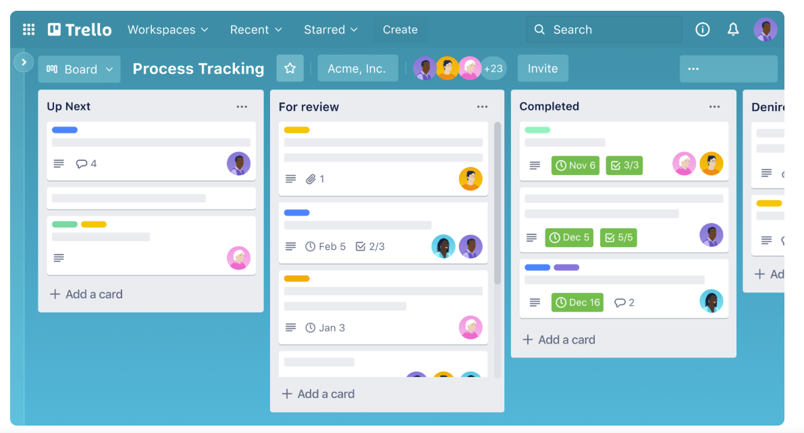

## 📋 Jak prowadzić projekt – **workflow + Trello**

### 📌 **Zalecany workflow: Kanban (Trello)**

Utwórzcie tablicę Trello z kolumnami:

1. 🧠 **Backlog** – wszystkie US-y z tej listy
2. 🔧 **Do zrobienia** – rzeczy planowane na aktualną sesję
3. 🛠️ **W trakcie** – aktywnie kodowane
4. ✅ **Do przetestowania** – zrobione, ale wymaga testów
5. 🎉 **Gotowe** – ukończone i zatwierdzone

---

### 🧭 **Zarządzanie zadaniami w Trello**

Dla każdego **User Story**:

- Utwórz **kartę Trello**
- W opisie umieść:
  - treść User Story
  - warunki zakończenia (DoD)
- Dodaj **checklistę z DoD** i odhaczaj punkty w trakcie
- Ustaw **członka zespołu** jako odpowiedzialnego
- Użyj **etykiet** np.:
  - `Backend`
  - `Frontend`
  - `PDF`
  - `Upload`
  - `Pilne`

---

### ✅ **Zalecenia organizacyjne**

- Codziennie/przed każdą sesją: przesuń zadania do „Do zrobienia”
- Po sesji: przesuń zadania do „Do przetestowania” lub „Gotowe”
- Każdy commit powinien być powiązany z kartą (np. w opisie `#US3`)

---

### 📦 **Na koniec projektu**

- Wszystkie karty powinny być w kolumnie **Gotowe**
- Checklisty DoD muszą być wypełnione
- Repozytorium zawiera całość kodu
---